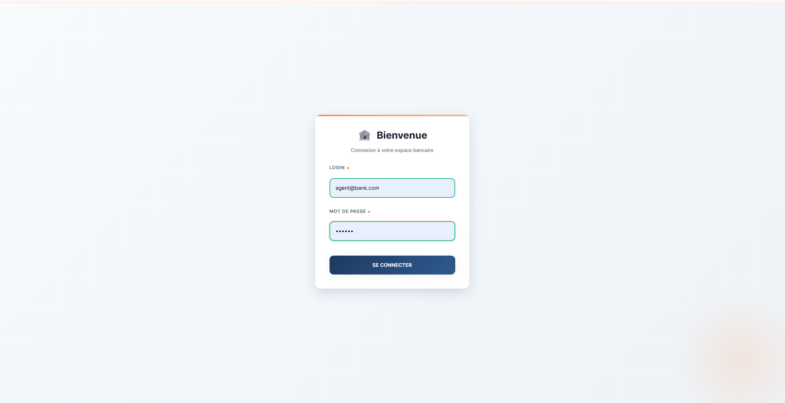
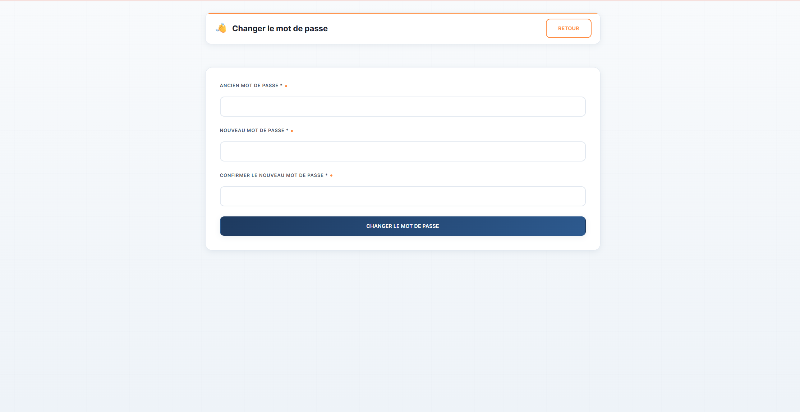
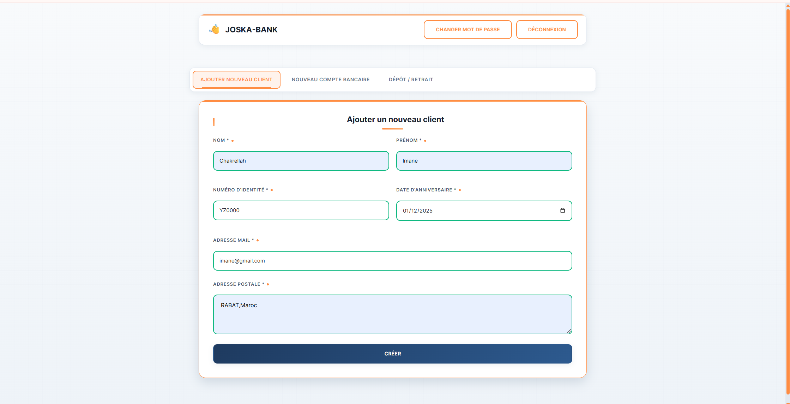
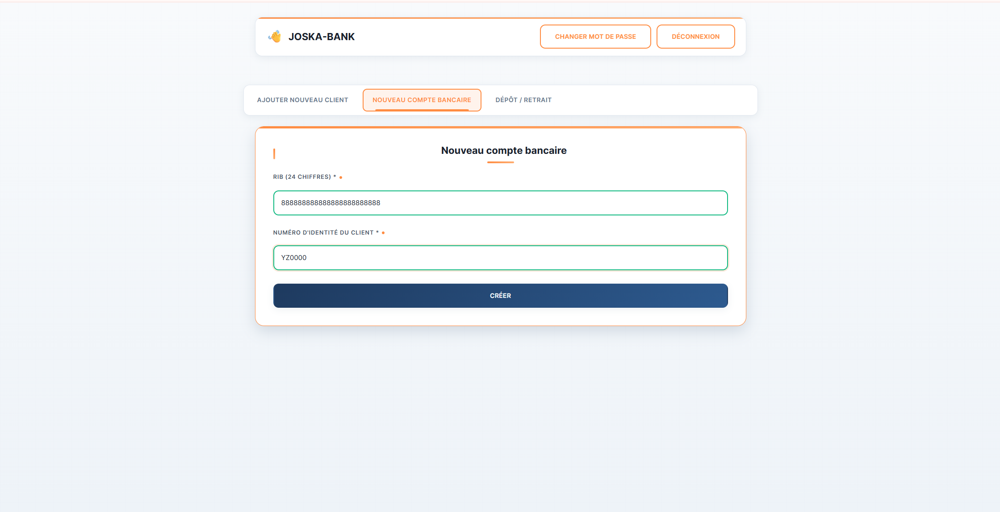
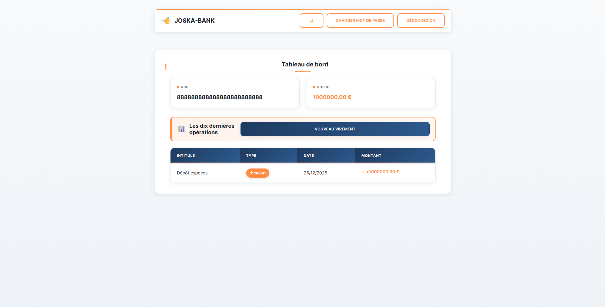
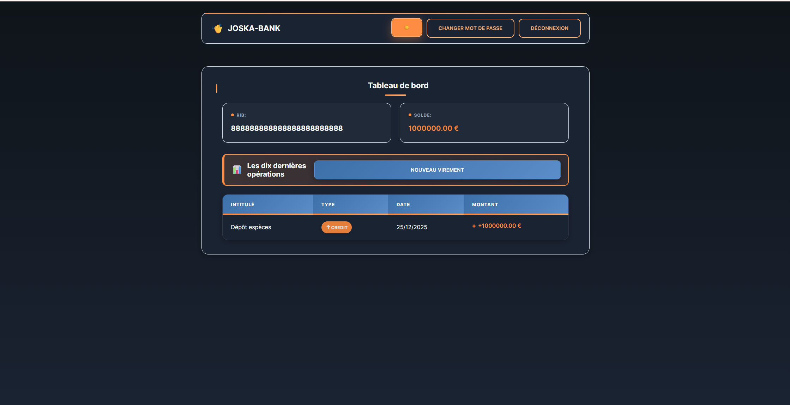
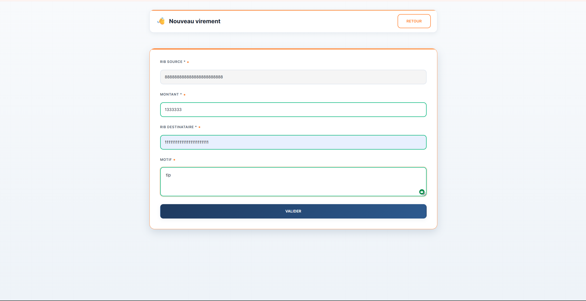
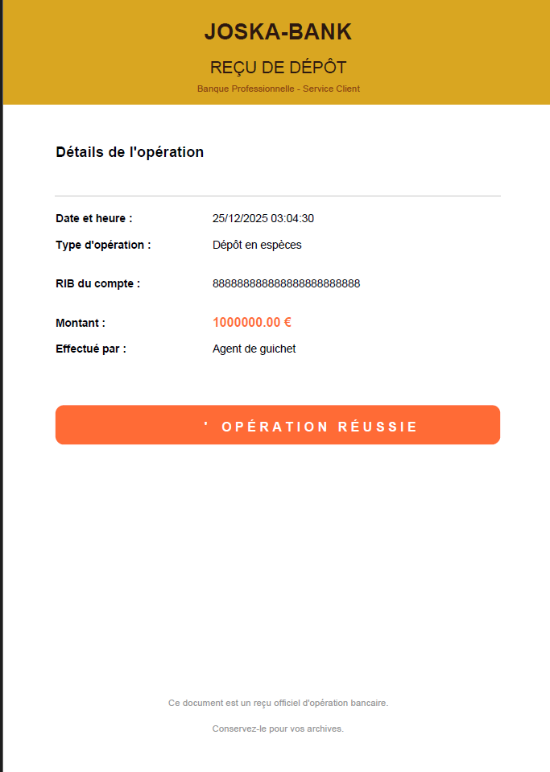

# 🏦 Application Bancaire - Architecture des Composants d'Entreprise

Application bancaire complète avec frontend React et backend Spring Boot utilisant la base de données H2.

## 📁 Structure du Projet

```
Architecture/
├── backend/          # Application Spring Boot
│   ├── src/
│   │   ├── main/
│   │   │   ├── java/com/bank/
│   │   │   │   ├── config/        # Configuration
│   │   │   │   ├── controller/    # Contrôleurs REST
│   │   │   │   ├── dto/           # Data Transfer Objects
│   │   │   │   ├── exception/     # Gestion des erreurs
│   │   │   │   ├── model/         # Entités JPA
│   │   │   │   ├── repository/    # Repositories
│   │   │   │   ├── security/      # Configuration sécurité
│   │   │   │   ├── service/       # Services métier
│   │   │   │   └── util/          # Utilitaires
│   │   │   └── resources/
│   │   │       └── application.properties
│   └── pom.xml
├── frontend/         # Application React
│   ├── public/
│   ├── src/
│   │   ├── components/    # Composants réutilisables
│   │   ├── context/       # Context React (Auth)
│   │   ├── pages/         # Pages de l'application
│   │   ├── App.js
│   │   └── index.js
│   └── package.json
└── README.md
```

## 🛠️ Prérequis

- Java 17 ou supérieur
- Maven 3.6+
- Node.js 16+ et npm
- IDE (IntelliJ IDEA, Eclipse, ou VS Code)

## 🚀 Installation et Lancement

### Backend (Spring Boot)

1. Naviguez vers le dossier backend :
```bash
cd backend
```

2. Compilez et lancez l'application :
```bash
mvn spring-boot:run
```

L'application backend sera accessible sur `http://localhost:8080`

- Console H2 : `http://localhost:8080/h2-console`
  - JDBC URL: `jdbc:h2:mem:bankdb`
  - Username: `sa`
  - Password: (vide)

### Frontend (React)

1. Ouvrez un nouveau terminal et naviguez vers le dossier frontend :
```bash
cd frontend
```

2. Installez les dépendances :
```bash
npm install
```

3. Lancez l'application :
```bash
npm start
```

L'application frontend sera accessible sur `http://localhost:3000`

## 👥 Utilisateurs par Défaut

### 🔧 Agent Guichet
- **Login**: `agent@bank.com`
- **Mot de passe**: `agent123`
- **Profil**: `AGENT_GUICHET`

### 👤 Client (créé après inscription)
- **Login**: (email du client)
- **Mot de passe**: (généré automatiquement et envoyé par email)
- **Profil**: `CLIENT`

## ✨ Fonctionnalités

### Pour le profil AGENT_GUICHET
- ✅ Ajouter nouveau client
- ✅ Créer nouveau compte bancaire
- ✅ Effectuer un dépôt ou retrait d'argent
- ✅ Consulter les reçus des opérations

### Pour le profil CLIENT
- ✅ Consulter Tableau de bord
  - Affiche le RIB
  - Affiche le solde du compte
  - Liste les 10 dernières opérations bancaires
  - Permet de sélectionner parmi plusieurs comptes
- ✅ Effectuer un nouveau virement
- ✅ Consulter les reçus de virement

### Fonctionnalités communes
- 🔐 Changer mot de passe
- 🔑 Authentification par JWT (validité 1 heure)

## 📋 Règles Métier Implémentées

### Authentification (RG_1, RG_2, RG_3)
- **RG_1**: Les mots de passe sont cryptés avec BCrypt
- **RG_2**: Affichage "Login ou mot de passe erronés" en cas d'erreur
- **RG_3**: Token JWT valide 1 heure, affichage "Session invalide, veuillez s'authentifier" si expiré

### Création de Client (RG_4, RG_5, RG_6, RG_7)
- **RG_4**: Numéro d'identité unique
- **RG_5**: Tous les champs obligatoires validés
- **RG_6**: Adresse mail unique
- **RG_7**: Envoi d'email avec login et mot de passe (en mode développement, affichage dans la console)

### Création de Compte (RG_8, RG_9, RG_10)
- **RG_8**: Vérification de l'existence du client
- **RG_9**: Validation du RIB (24 chiffres)
- **RG_10**: Compte créé avec statut "Ouvert"

### Virement (RG_11, RG_12, RG_13, RG_14, RG_15)
- **RG_11**: Vérification que le compte n'est pas bloqué ou clôturé
- **RG_12**: Vérification du solde suffisant
- **RG_13**: Débit du compte source
- **RG_14**: Crédit du compte destinataire
- **RG_15**: Traçage des deux opérations avec dates précises

## 🔌 API Endpoints

### Authentification
- `POST /api/auth/login` - Connexion
- `POST /api/auth/change-password` - Changer mot de passe

### Clients (Agent Guichet)
- `POST /api/clients` - Créer un client

### Comptes Bancaires (Agent Guichet)
- `POST /api/accounts` - Créer un compte
- `POST /api/accounts/operation` - Effectuer un dépôt ou retrait

### Dashboard (Client)
- `GET /api/dashboard?rib=xxx` - Obtenir le tableau de bord

### Virements (Client)
- `POST /api/transfers` - Effectuer un virement

## 💻 Technologies Utilisées

### Backend
- Spring Boot 3.2.0
- Spring Security avec JWT
- Spring Data JPA
- H2 Database
- Lombok
- Spring Mail

### Frontend
- React 18
- React Router DOM 6
- Axios
- CSS3 (Design professionnel avec accents orange)

---

## 📸 Captures d'écran

### 1. Connexion Agent Guichet ou Client

*Page de connexion sécurisée pour l'agent guichet*


### 3. Changement de Mot de Passe - Agent ou Client

*Formulaire de changement de mot de passe pour l'agent avec indicateur de force*


### 5. Création d'un Nouveau Client

*Formulaire de création d'un nouveau client par l'agent guichet*

### 6. Logs de Création Client

*Console affichant les logs de création et l'email généré automatiquement*

### 7. Création de Compte Bancaire

*Interface de création d'un nouveau compte bancaire*

### 8. Dépôt ou Retrait d'Argent

*Formulaire pour effectuer des opérations de dépôt ou retrait*

### 9. Dashboard Client

*Tableau de bord client affichant le solde et l'historique des opérations*

### 9. Mode sombre Dashboard Client

*Tableau de bord client affichant le solde et l'historique des opérations*

### 10. Nouveau Virement - Client

*Interface de création d'un virement bancaire*

### 11. Reçu de Transaction - Agent ou virement client 

*Reçu d'opération pour l'agent guichet*


---

## 🎨 Design et UX

L'application utilise un design bancaire professionnel avec :
- 🔵 **Palette de couleurs** : Bleu marine pour la confiance et la stabilité
- 🟠 **Accents orange** : Pour dynamiser l'interface et guider l'attention
- 🌙 **Mode sombre** : Support complet pour une expérience confortable
- ✨ **Animations fluides** : Transitions et effets modernes
- 📱 **Responsive design** : Compatible mobile, tablette et desktop

---

## 📝 Notes de Développement

### Environnement de Développement
- Les emails sont affichés dans la console backend
- La base de données H2 est en mémoire (données perdues au redémarrage)
- Les tokens JWT expirent après 1 heure

### Sécurité
- Tous les mots de passe sont hashés avec BCrypt
- Protection CSRF activée
- Validation des entrées côté frontend et backend
- Gestion des erreurs avec messages appropriés

---

## 🐛 Dépannage

### Le backend ne démarre pas
- Vérifiez que Java 17+ est installé : `java -version`
- Assurez-vous que le port 8080 est libre
- Nettoyez et recompilez : `mvn clean install`

### Le frontend ne démarre pas
- Vérifiez que Node.js est installé : `node --version`
- Supprimez `node_modules` et réinstallez : `npm install`
- Assurez-vous que le port 3000 est libre

### Problèmes d'authentification
- Vérifiez que le backend est bien démarré
- Consultez la console browser (F12) pour les erreurs
- Vérifiez que le token JWT n'est pas expiré

---

## 📚 Documentation Supplémentaire

Pour plus d'informations sur les technologies utilisées :
- [Spring Boot Documentation](https://spring.io/projects/spring-boot)
- [React Documentation](https://react.dev/)
- [Spring Security](https://spring.io/projects/spring-security)
- [JWT.io](https://jwt.io/)

---

## 👨‍💻 Auteurs

**Réalisé par le binôme Joska**
Yassine Ech-chaoui :echchaoui.yassine@gmail.com
imane chakrellah : chakrellaah@gmail.com 

---

